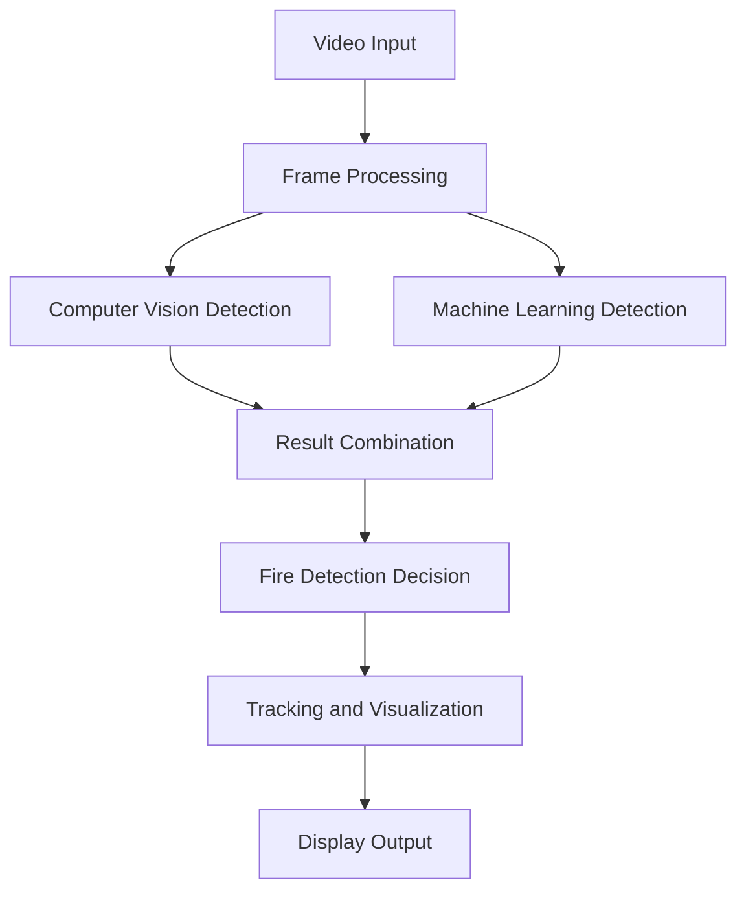
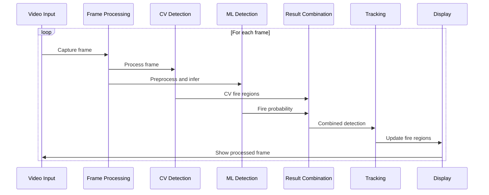

# Fire Detection System

This project implements a real-time fire detection system using computer vision and machine learning techniques. It combines traditional computer vision methods with a deep learning model to detect fires in video streams.

## Table of Contents
- [Overview](#overview)
- [System Architecture](#system-architecture)
- [Installation](#installation)
- [Usage](#usage)
- [Key Components](#key-components)
- [Algorithm](#algorithm)
- [License](#license)

## Overview

The Fire Detection System uses a combination of computer vision techniques and a machine learning model to detect fires in real-time video streams. It processes each frame using both approaches and combines their results for more accurate fire detection.

## System Architecture



## Installation

1. Clone this repository:
   ```
   git clone https://github.com/yourusername/fire-detection-system.git
   cd fire-detection-system
   ```

2. Install the required dependencies:
   ```
   pip install opencv-python numpy keras pillow scipy torchvision
   ```

3. Download the pre-trained model file `fire_smoke_detection_model.h5` and place it in the `models/` directory.

## Usage

Run the main script to start the fire detection system:

```
python main.py
```

Press 'q' to quit the application.

## Key Components

1. `FireDetectionModel`: A singleton class that loads and manages the machine learning model.
2. `KalmanTracker`: Implements Kalman filtering for smooth tracking of detected fire regions.
3. `detect_fire_cv`: Performs computer vision-based fire detection using color and motion analysis.
4. `update_tracked_fires`: Manages the tracking of fire regions across frames.

## Algorithm

The fire detection algorithm follows this sequence:



1. Capture a frame from the video input.
2. Perform computer vision-based fire detection:
   - Create a fire mask using color thresholding.
   - Detect motion by comparing with the previous frame.
   - Combine color and motion information to identify potential fire regions.
3. Run the machine learning model on the preprocessed frame to get a fire probability.
4. Combine the results from both methods using a weighted sum.
5. Apply temporal smoothing to reduce false positives.
6. Update tracked fire regions using the Hungarian algorithm and Kalman filtering.
7. Visualize the results on the frame and display it.


## License

This project is licensed under the MIT License. See the [LICENSE](LICENSE) file for details.
